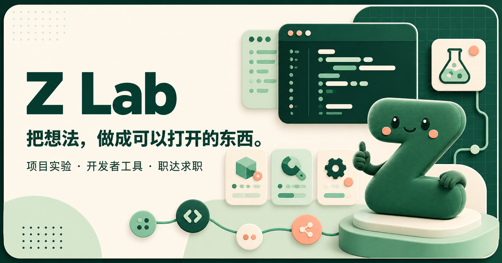

# Z Lab · 个人开发实验室

一个持续迭代的个人网站项目：把求职、学习、生活工具和轻量娱乐放在同一个清晰、可离线使用的空间里。

[在线体验](https://zhangjik.bbroot.com/?v=project22#home)



## 主要功能

- 简历制作：多套模板、资料导入、多段经历、实时预览、版本管理和 PDF 导出。
- 岗位搜索：关键词、省份、城市、企业类型、招聘批次和招聘对象筛选。
- 投递管理：收藏、已投递、面试与 Offer 状态管理，并支持记录和导出。
- 学习空间：四级、六级、考研词卡，每日一题和错题本。
- 工具箱：随机转盘、二维码、倒计时、JSON、文本统计、时间戳、编解码和密码生成。
- 生活与娱乐：便签、书签、待办、记账、图片处理、配色、Markdown、小型网页游戏。
- 游戏攻略：燕云十六声站内攻略、搜索分类、单文件离线下载和首次访问后缓存。

## 项目结构

```text
public/                 当前线上静态网站
  index.html            页面结构
  app.js                交互与本地数据逻辑
  styles.css            响应式视觉样式
  data/                 公开词库与站内整理攻略
  vendor/               浏览器端文档和二维码工具
server/                 Nginx 与访问计数服务示例
sync_jobs.py            双来源岗位数据清洗与同步脚本
zhida-job-sync.cron     两小时同步计划示例
app/                    早期 React 界面原型，作为设计演进记录
```

## 本地运行

网站主体不依赖构建工具。在项目根目录运行：

```bash
python -m http.server 4173 -d public
```

然后访问 `http://localhost:4173/`。

岗位搜索在没有生成数据文件时会使用内置演示岗位。`public/jobs-data.json` 由在线招聘数据同步任务生成，包含持续变化的第三方数据，因此不会提交到公开仓库。

## 数据与隐私

- 简历、投递记录、便签等个人数据默认保存在访问者自己的浏览器中。
- 简历文档解析和图片处理均在浏览器本地完成。
- 服务器私钥、环境变量、访问数据库和完整在线岗位数据已通过忽略规则排除。
- 岗位与攻略内容可能随来源或游戏版本变化，请以原始页面及当前游戏内容为准。

## 技术特点

- 原生 HTML、CSS 和 JavaScript，零框架运行主站。
- Service Worker 提供核心页面与攻略的离线缓存。
- LocalStorage 保存用户侧状态，避免不必要的个人数据上传。
- Python 完成岗位归一化、去重与原子更新。
- Nginx 提供静态站点和同源访问统计接口。

## 第三方资料

第三方库、词库和攻略资料的来源说明见 [THIRD_PARTY_NOTICES.md](THIRD_PARTY_NOTICES.md)。完整岗位数据不包含在本仓库中。

## 项目状态

这是一个个人学习与产品实践项目，仍在持续迭代。欢迎通过 Issue 提交问题和功能建议。
