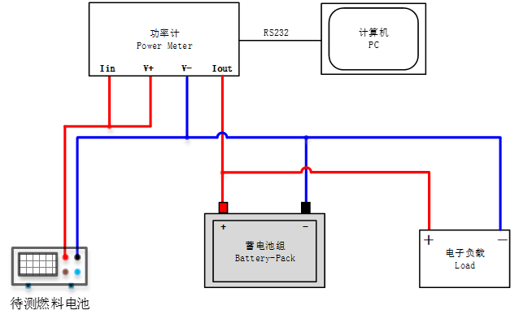
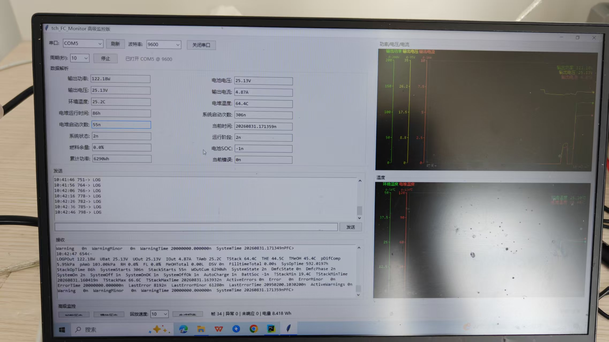
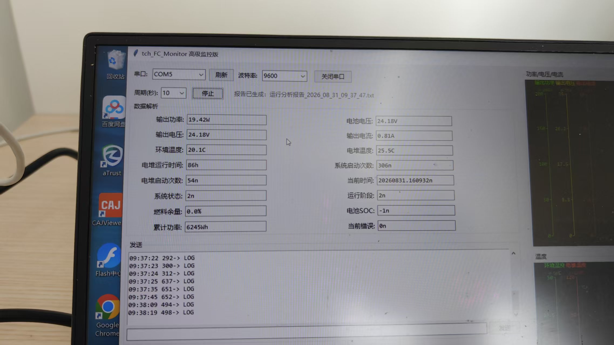
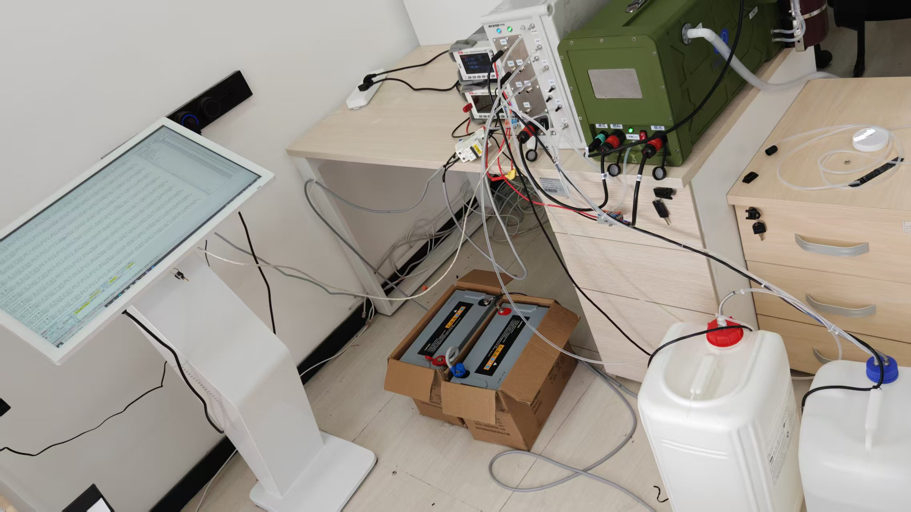
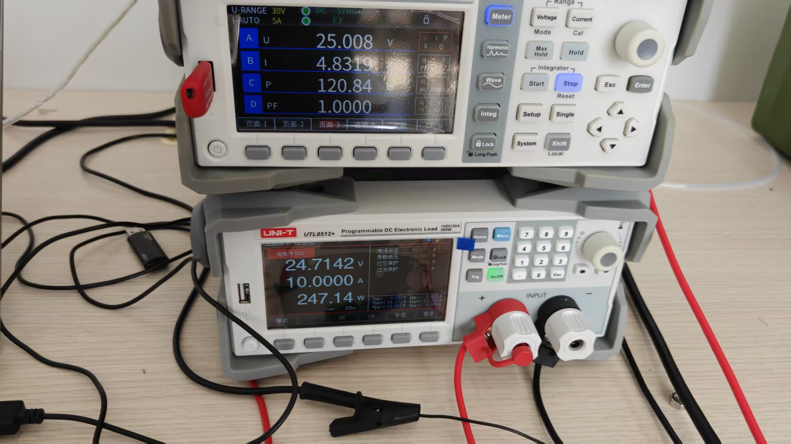
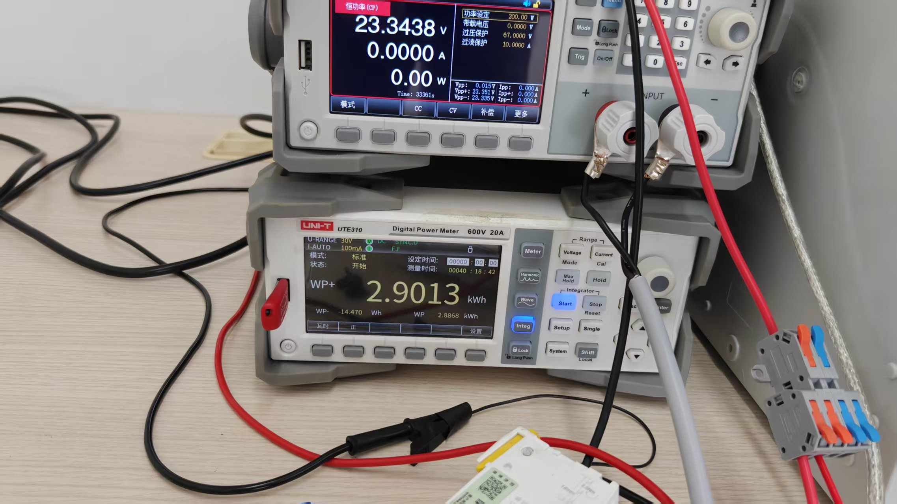
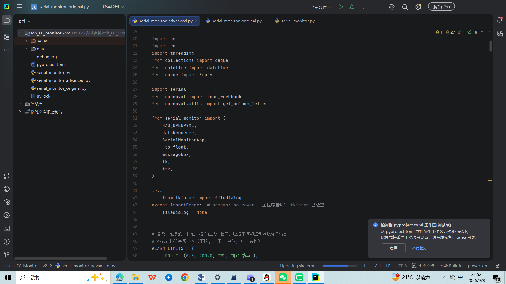
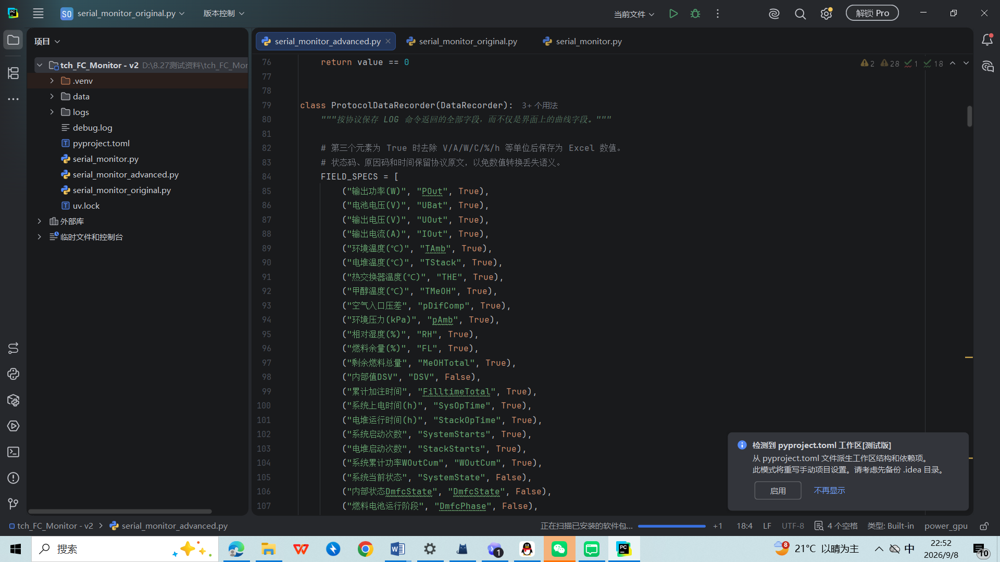

# 燃料电池监控上位机系统

这是一个面向直接甲醇燃料电池功率测试的 Python 监控上位机。项目由本人完成测试回路接线、串口协议分析、上位机开发和现场联调，并使用真实燃料电池、蓄电池组、功率计和电子负载完成线下测试。

## 项目做了什么

- 通过串口周期发送 `LOG` 命令，读取燃料电池运行数据；
- 解析功率、电压、电流、环境温度、电堆温度、燃料余量、运行时间、状态和错误码；
- 实时显示数据并绘制功率、电压、电流和温度曲线；
- 将采样数据保存为 Excel，支持历史数据加载和回放；
- 识别越限参数、设备告警和错误记录；
- 统计完整响应、异常帧、未响应请求和累计输出电量；
- 串口异常后自动重连，并生成运行分析报告。

## 测试系统



燃料电池作为供电端，电子负载模拟耗电工况，蓄电池组用于能量缓冲，功率计用于测量回路的电压、电流和累计电量。上位机通过串口读取燃料电池内部状态，并将通信数据与外部仪器读数结合分析。

由于蓄电池参与缓冲，燃料电池输出功率与电子负载消耗功率在瞬时不一定相等。测试时应同时记录测量位置、负载设定和采集时间范围。

## 实测照片









## 运行

项目依赖 Python 3.14、`pyserial` 和 `openpyxl`，界面使用 Tkinter。进入 `tch_FC_Monitor - v2` 目录后运行：

```powershell
uv sync
uv run python serial_monitor_advanced.py
```

也可以使用已有虚拟环境：

```powershell
.venv\Scripts\python.exe serial_monitor_advanced.py
```

打开串口后选择现场使用的端口和波特率。当前燃料电池 SIO 实测配置为 9600 baud；程序默认每 10 秒发送一次 `LOG`，周期可在界面调整。

## 协议摘要

公开版协议说明见 [docs/protocol-summary.md](docs/protocol-summary.md)。原始厂商设备资料不随项目公开发布。

## 实测结果

现有长时间测试记录包含 2,133 次 `LOG` 请求、2,131 个完整响应和 2,131 个有效采样，报告计算得到约 717.47 Wh 的本次采集累计输出电量。不同仪器显示的累计值属于不同时间范围和测量口径，不能直接作为同一指标比较。

## 目录

```text
燃料电池监控上位机监控/
├─ tch_FC_Monitor - v2/       # 程序源码、实验数据和运行报告
├─ docs/
│  ├─ images/                 # 公开展示图片
│  ├─ protocol-summary.md     # 脱敏协议摘要
│  └─ test-setup.md           # 接线与测试说明
└─ README.md
```

## 公开范围

项目公开代码、接线示意图、实测图片、脱敏示例数据和协议摘要。厂商提供的原始 SIO 协议与 TFM6 规格书仅作为本地开发参考，不上传到公开仓库。
